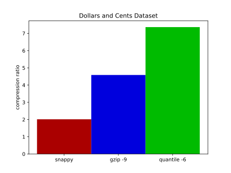
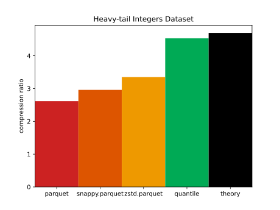
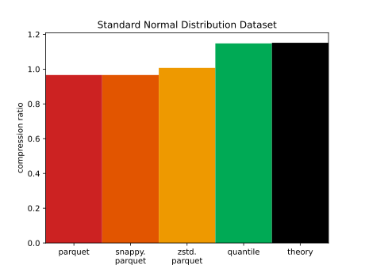
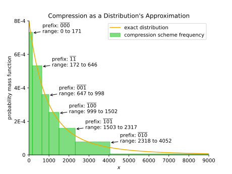
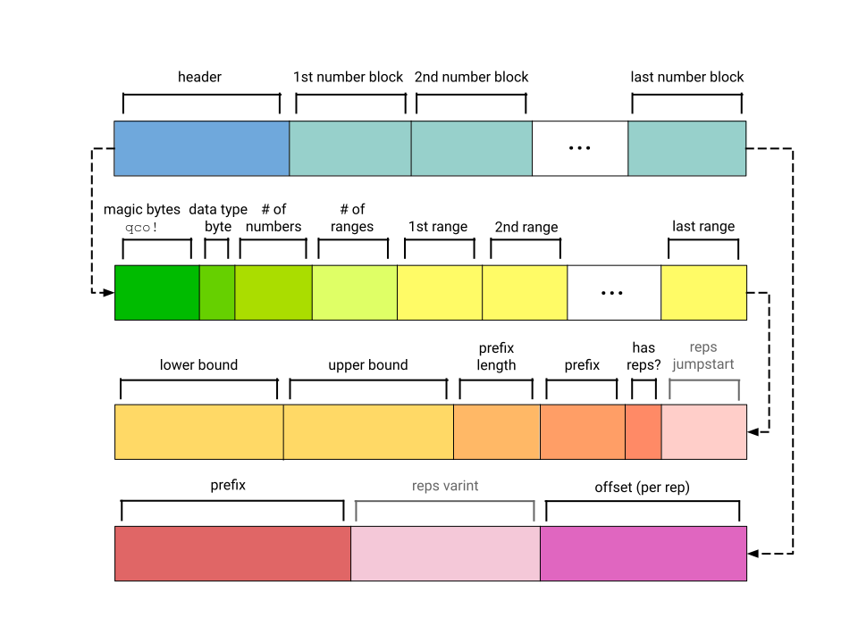

# Quantile Compression

<div style="text-align:center">


</div>
<div style="text-align:center">


</div>

This rust library compresses and decompresses sequences of
numerical data very well.
It currently supports the following data types:
`i32`, `i64`, `u32`, `u64`, `f32`, `f64`.
Smaller data types like `i16` can be efficiently compressed by casting
to `i32`.
Timestamp support may come soon in the future.

For natural data, it typically shrinks data to 25-40% smaller than what
`gzip -9` produces, compresses much faster, and decompresses equally
quickly.

The intended use case for this algorithm is compressing columnar
data, especially for use by Spark and other execution engines.

This IS:
* lossless
* order-preserving
* moderately fast

This is NOT:
* lossy
* for multisets
* optimal for time series with high mutual information between consecutive elements

## Usage

See the following basic usage.
To run something right away, see [the example](./example/example.md).

```
use q_compress:{BitReader, I64Compressor, I64Decompressor};

fn main() {
  // your data
  let mut my_ints = Vec::new();
  for i in 0..100000 {
    my_ints.push(i as i64);
  }
  
  // compress
  // max_depth is basically compression level - 6 is generally good.
  // Max depths between 4 and 8 are reasonable.
  let max_depth = 6;
  let compressor = I64Compressor::train(&my_ints, max_depth).expect("failed to train");
  let bytes = compressor.compress(&my_ints).expect("out of range");
  println!("compressed down to {} bytes", bytes.len());
  
  // decompress
  let bit_reader = &mut BitReader::from(bytes);
  let decompressor = I64Decompressor::from_reader(bit_reader).expect("couldn't read compression scheme");
  let recovered = decompressor.decompress(bit_reader);
  println!("got back {} ints from {} to {}", recovered.len(), recovered[0], recovered.last().unwrap());
}
```

## Method

This works by describing each number with a _range_ and an _offset_.
The range specifies an inclusive range `[lower, upper]` that the
number might be in, and the offset specifies the exact position within that
range.
The compressor chooses a _prefix_ for each range via Huffman
codes.

For data sampled from a random distribution, this compression algorithm can
reduce byte size to near the theoretical limit of the distribution's Shannon
entropy.
Ideally it encodes a number `k` in `b` bits
if `2^-b ~= P(k)`.
We can plot `Q(k) = 2^-b` to see how close quantile compression gets to the
ideal in this example with `max_depth=3`:



The inefficiency of quantile compression in bits per number is the KL
divergence from
the approximated distribution `Q` to the true distribution `P`.

## `.qco` File Format



Quantile-compressed files consist of a lightweight header (usually <1KB)
and then very many short number blocks, each of which usually
encodes a single number.

The header is expected to start with a magic sequence of 4 bytes for "qco!"
in ascii.
The next byte encodes the data type (e.g. `i64`).
The next few bytes encode the count of numbers in the file,
and then the count of ranges (or prefixes) used to compress.
It then contains metadata for each range: lower and upper bound,
the length of its prefix in bits, the prefix.
The next bit for each range encodes whether it uses repetitions, which are only
used for the most common range in a sparse distribution.
If so, the file then encodes a "jumpstart", which is used in number
blocks to describe how many repetitions of the range to use.

Each number block has just 2 or 3 parts. First comes the prefix, which indicates a range
to use.
If that range uses repetitions, a varint for the exact number of repetitions
follows, leveraging the jumpstart from earlier.
Then an offset (for each repetition if necessary) follows,
specifying the exact value within the range.
