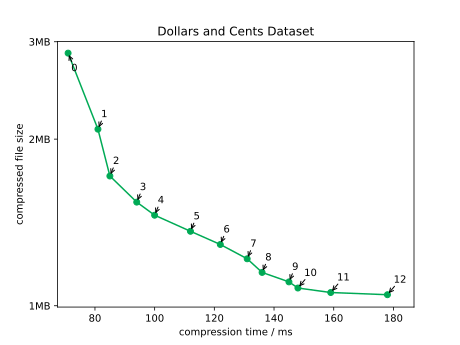
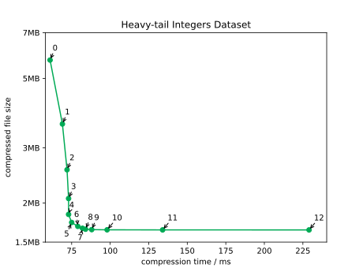

[![Crates.io][crates-badge]][crates-url]

[crates-badge]: https://img.shields.io/crates/v/q-compress.svg
[crates-url]: https://crates.io/crates/q-compress

# Quantile Compression

Quantile Compression losslessly compresses and decompresses numerical sequences
with high compression ratio and moderately fast speed.

**Use cases:**
* compression for columnar data
* compression for time series data
* low-bandwidth communication, like transmitting batches of sensor data from
  space probes

**Data types:**
`bool`,
`i16`, `i32`, `i64`,
`u16`, `u32`, `u64`,
`f32`, `f64`,
`TimestampMicros`, `TimestampNanos`,
and optionally `i128`, `u128`, `TimestampMicros96`, `TimestampNanos96`

**Features:**
* stable standalone file format (`.qco`)
* wrapped format for interleaving within a columnar table
* preserves ordering and exact bit representation (including `NaN` floats)
* supports nth-order delta encoding up to order 7 (e.g. 2nd order is delta-of-deltas)
* compresses faster or slower depending on compression level from 0 to 12
* greatest common divisor detection
* chunked compression and streaming decompression

## Get Started

[Use the CLI](./q_compress_cli/README.md)

[Use the Rust API](./q_compress/README.md)

[Use the JVM API](https://github.com/mwlon/q-compress-jni)

## Performance

See [benchmarks.md](./benchmarks.md).

Here are two examples of the compressed file size vs. compression time tradeoff
as compression level increases for a given dataset.
Each point is annotated with the compression level used:

The Total Cents dataset is very intricate and still sees improvement for
high compression levels.
But most data, like the Heavy-tail Integers dataset, is already well-compressed
by level 6 or so.

## Method

This works by describing each number with a Huffman code and an _offset_.
The Huffman code corresponds to a range `[lower, upper]` that the
number is in, and the offset specifies the exact position within that
range.

Compression happens in this order for each chunk:
1. If delta encoding is on, compute deltas and use those as your values
   instead.
2. Determine unoptimized _prefixes_ by taking `2^compression_level` roughly evenly-spaced
   quantiles of the distribution.
   Each prefix is simply a range and associated metadata.
   If GCD is on, this also detects the greatest common divisor for each range.
3. Optimize prefixes, combining adjacent ones if advantageous.
4. Determine Huffman codes for each prefix based on its weight in the data.
5. Encode deltas using prefixes.

For data sampled from a random distribution, this compression algorithm can
reduce byte size to near the theoretical limit of the distribution's Shannon
entropy.
Ideally it encodes a number `k` with probability `P(k)` in `b` bits
if `2^-b ~= P(k)`.
We can plot `Q(k) = 2^-b` to see how close quantile compression gets to the
ideal in this example with `compression_level=3`:

The inefficiency of quantile compression in bits per number is the KL
divergence from
the approximated distribution `Q` to the true distribution `P`.

## `.qco` File Format

Quantile-compressed files consist of a lightweight header,
then chunks containing metadata and numerical data, finished by a magic
termination byte.

The header is expected to start with a magic sequence of 4 bytes for "qco!"
in ASCII.
The next byte encodes the data type (e.g. `i64`).
Then flags are encoded, which might affect the rest of the encoding.
For instance, if delta encoding of order > 0 is on, then that many delta
moments will be encoded in each of the following chunk metadata sections.

Each chunk begins with a magic "chunk" byte.
Then the metadata section follows, containing the count of numbers,
the byte size of the compressed body to follow, and prefixes
used to compress.
Each prefix has a count of numbers in its range, a lower and upper bound,
a Huffman code, and optionally a "jumpstart" which is used in
number blocks to describe how many repetitions of the range to use.
There must be at least one number in each chunk.

Each chunk body consists of many small number blocks, each of which encodes a
single number.
Each number block begins with a prefix for the range the number is in.
If that range uses repetitions, a varint for the exact number of repetitions
follows, leveraging the jumpstart from earlier.
Then an offset (for each repetition if necessary) follows,
specifying the exact value within the range.

At the end of the file is a termination byte.

Quantle compression can also be used to write data pages interleaved into a
columnar format, as opposed to writing a standalone file.
