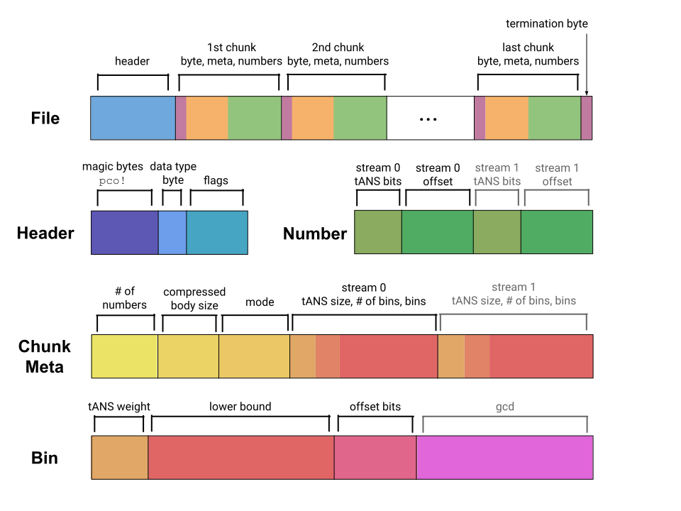

[Click here for Quantile Compression](./quantile-compression/README.md).

# Pcodec

Pcodec (or pco, pronounced "pico") losslessly compresses and decompresses
numerical sequences
with high compression ratio and moderately fast speed.

**Use cases:**
* compression for columnar data
* compression for time series data
* low-bandwidth communication

**Features:**
* stable standalone file format (`.pco`)
* wrapped format for interleaving within another format
* preserves ordering and exact bit representation (including `NaN` floats)
* supports nth-order delta encoding up to order 7 (e.g. 2nd order is delta-of-deltas)
* compresses faster or slower depending on compression level from 0 to 12
* greatest common divisor detection
* floating point multiplier detection
* chunked compression and streaming decompression

**Data types:**
`u32`, `u64`, `i32`, `i64`, `f32`, `f64`

It is also possible to implement your own data type via `NumberLike` and (if
necessary) `UnsignedLike` and `FloatLike`.
For smaller integers or timestamps, it is best to simply case to one of the
natively supported data types.

## Get Started

[Use the CLI](./pco_cli/README.md)

[Use the Rust API](./pco/README.md)

## Performance and Compression Ratio

See [benchmarks.md](./bench/README.md) to run the benchmark suite
or see its results.

## File Format

The core idea of pco is to represent numbers as approximate, entropy-coded bins
paired with exact offsets into those bins.
Depending on the mode, there may be 1 or 2 streams of these bin-offset
pairings.

## Extra

[join the Discord](https://discord.gg/f6eRXgMP8w)

## Etymology

The names pcodec and pco were chosen for these reasons:
* "Pico" suggests that it makes very small things.
* Pco is reminiscent of qco, its preceding format.
* Pco is reminiscent of PancakeDB (Pancake COmpressed). Though PancakeDB is now
  unmaintained, it had a good name.
* Pcodec is short, provides some semantic meaning, and should be easy to
  search for.

The names are used for these purposes:
* pco => the library and data format
* pco_cli => the binary crate name
* pcodec => the binary CLI and the repo