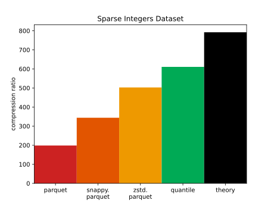
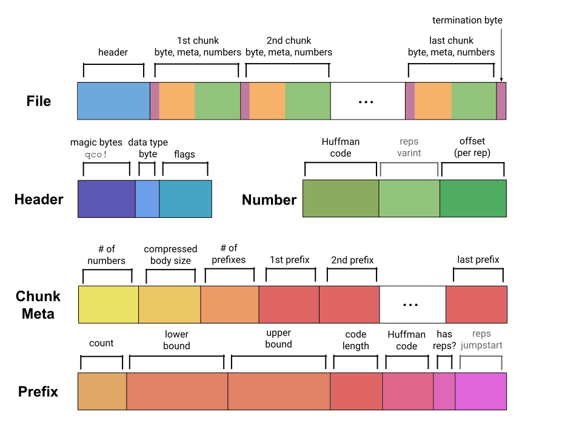

[![Crates.io][crates-badge]][crates-url]

[crates-badge]: https://img.shields.io/crates/v/q-compress.svg
[crates-url]: https://crates.io/crates/q-compress

# Quantile Compression

<div style="text-align:center">


</div>
<div style="text-align:center">


</div>

Quantile Compression losslessly compresses and decompresses numerical sequences
with high compression ratio and moderately fast speed.

**Use cases:**
* compression for columnar data
* compression for time series data
* low-bandwidth communication, like transmitting batches of sensor data from
  space probes

**Data types:**
`i32`, `i64`, `i128`, `u32`, `u64`, `f32`, `f64`,
`q_compress::TimestampMicros`,
`q_compress::TimestampNanos`

**Features:**
* stable file format (`.qco`)
* preserves ordering and exact bit representation (including `NaN` floats)
* supports nth-order delta encoding up to order 7 (e.g. 2nd order is delta-of-deltas)
* compresses faster or slower depending on compression level from 0 to 12

## Performance

See [benchmarks.md](./benchmarks.md).

Here are two examples of the compressed file size vs. compression time tradeoff
as compression level increases for a given dataset.
Each point is annotated with the compression level used:

<div style="text-align:center">


</div>

The Total Cents dataset is very intricate and still sees improvement for
high compression levels.
But most data, like the Heavy-tail Integers dataset, is already well-compressed
by level 6 or so.

## Usage

```rust
use q_compress::{Compressor, Decompressor};

fn main() {
  // your data
  let mut my_ints = Vec::new();
  for i in 0..100000 {
    my_ints.push(i as i64);
  }
 
  // Here we just use the default configuration, but we can also use
  // `::from_compressor_config()` to set configurations like
  // `compression_level` and `delta_encoding_order`.
  let compressor = Compressor::<i64>::default();
  let bytes: Vec<u8> = compressor.simple_compress(&my_ints);
  println!("compressed down to {} bytes", bytes.len());
 
  // decompress
  let decompressor = Decompressor::<i64>::default();
  let recovered = decompressor.simple_decompress(&bytes).expect("failed to decompress");
  println!("got back {} ints from {} to {}", recovered.len(), recovered[0], recovered.last().unwrap());
}
```

To run something right away, see
[the primary example](./examples/primary.md).

For a lower-level API that allows writing/reading one chunk at a time and
extracting all metadata, see [the docs.rs documentation](https://docs.rs/q_compress/latest/q_compress/).

## Method

This works by describing each number with a Huffman code and an _offset_.
The Huffman code corresponds to a range `[lower, upper]` that the
number is in, and the offset specifies the exact position within that
range.

Compression happens in this order for each chunk:
1. If delta encoding is on, compute deltas and use those as your values
   instead.
2. Determine unoptimized _prefixes_ by taking `2^compression_level` roughly evenly-spaced
   quantiles of the distribution.
   Each prefix is simply a range and associated metadata.
3. Optimize prefixes, combining adjacent ones if advantageous.
4. Determine Huffman codes for each prefix based on its weight in the data.
5. Encode deltas using prefixes.

For data sampled from a random distribution, this compression algorithm can
reduce byte size to near the theoretical limit of the distribution's Shannon
entropy.
Ideally it encodes a number `k` with probability `P(k)` in `b` bits
if `2^-b ~= P(k)`.
We can plot `Q(k) = 2^-b` to see how close quantile compression gets to the
ideal in this example with `compression_level=3`:


The inefficiency of quantile compression in bits per number is the KL
divergence from
the approximated distribution `Q` to the true distribution `P`.

## `.qco` File Format



Quantile-compressed files consist of a lightweight header,
then chunks containing metadata and numerical data, finished by a magic
termination byte.

The header is expected to start with a magic sequence of 4 bytes for "qco!"
in ASCII.
The next byte encodes the data type (e.g. `i64`).
Then flags are encoded, which might affect the rest of the encoding.
For instance, if delta encoding of order > 0 is on, then that many delta
moments will be encoded in each of the following chunk metadata sections.

Each chunk begins with a magic "chunk" byte.
Then the metadata section follows, containing the count of numbers,
the byte size of the compressed body to follow, and prefixes
used to compress.
Each prefix has a count of numbers in its range, a lower and upper bound,
a Huffman code, and optionally a "jumpstart" which is used in
number blocks to describe how many repetitions of the range to use.
There must be at least one number in each chunk.

Each chunk body consists of many small number blocks, each of which encodes a
single number.
Each number block begins with a prefix for the range the number is in.
If that range uses repetitions, a varint for the exact number of repetitions
follows, leveraging the jumpstart from earlier.
Then an offset (for each repetition if necessary) follows,
specifying the exact value within the range.

At the end of the file is a termination byte.

## Library Changelog

See [changelog.md](./changelog.md)

## CLI

This is a partially-complete CLI.
See [CLI.md](./CLI.md).

## Advanced

### Custom Data Types

Small data types can be efficiently compressed by upcasting to the next
supported data type;
e.g. `u16` to `u32`.
In fact, the only cost to upcasting is a small increase in chunk metadata size.

When necessary, you can implement your own data type via
 `q_compress::types::NumberLike` and (if the existing signed/unsigned
implementations are insufficient)
`q_compress::types::SignedLike` and
`q_compress::types::UnsignedLike`.

### Seeking and Quantile Statistics

Recall that each chunk has a metadata section containing
* the total count of numbers in the chunk,
* the ranges for the chunk and count of numbers in each range,
* and the size in bytes of the compressed body.

Using the compressed body size, it is easy to seek through the whole file
and collect a list of all the chunk metadatas.
One can aggregate them to obtain the total count of numbers in the whole file
and even an approximate histogram.
This is typically about 100x faster than decompressing all the numbers.

See the [fast seeking example](examples/fast_seeking.rs).
