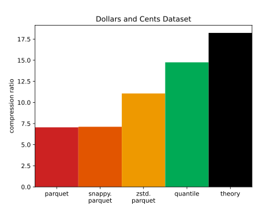

[![Crates.io][crates-badge]][crates-url]

[crates-badge]: https://img.shields.io/crates/v/q-compress.svg
[crates-url]: https://crates.io/crates/q-compress

# Quantile Compression

<div style="text-align:center">


</div>
<div style="text-align:center">


</div>

Quantile Compression compresses and decompresses sequences of
numerical data very well.
It currently supports the following data types:
`i8`, `i32`, `i64`, `i128`, `u32`, `u64`, `f32`, `f64`,
`q_compress::TimestampNanos`, `q_compress::TimestampMicros`.

For natural data, it typically shrinks data to 10-40% smaller than what
`gzip -9` produces, compresses much faster, and decompresses equally
quickly.

As of version `0.4.0`, the file format is stable.

## Use Cases

`q_compress` is:
* lossless
* order-preserving and bit-preserving (including `NaN` floats)
* moderately fast (see [benchmarks.md](./benchmarks.md)).
* effective on data with correlation between consecutive elements via
configuring `delta_encoding_order`

Use cases include:
* compression for columnar data
* low-bandwidth communication, like transmitting batches of sensor data from
space probes

## Usage

See the following basic usage.
To run something right away, see
[the primary example](./examples/primary.md).

```rust
use q_compress::{I64Compressor, I64Decompressor};

fn main() {
  // your data
  let mut my_ints = Vec::new();
  for i in 0..100000 {
    my_ints.push(i as i64);
  }
 
  // Here we just use the default configuration, but `CompressorConfig` contains
  // the following options:
  //   `compression_level` 0 to 12, default 6
  //   `delta_encoding_order` 0 to 7, default 0
  let compressor = I64Compressor::default();
  let bytes: Vec<u8> = compressor.simple_compress(&my_ints).expect("failed to compress");
  println!("compressed down to {} bytes", bytes.len());
 
  // decompress
  let decompressor = I64Decompressor::default();
  let recovered = decompressor.simple_decompress(bytes).expect("failed to decompress");
  println!("got back {} ints from {} to {}", recovered.len(), recovered[0], recovered.last().unwrap());
}
```

## Method

This works by describing each number with a _range_ and an _offset_.
The range specifies an inclusive range `[lower, upper]` that the
number might be in, and the offset specifies the exact position within that
range.
The compressor chooses a _prefix_ for each range via Huffman
codes.

For data sampled from a random distribution, this compression algorithm can
reduce byte size to near the theoretical limit of the distribution's Shannon
entropy.
Ideally it encodes a number `k` in `b` bits
if `2^-b ~= P(k)`.
We can plot `Q(k) = 2^-b` to see how close quantile compression gets to the
ideal in this example with `compression_level=3`:


The inefficiency of quantile compression in bits per number is the KL
divergence from
the approximated distribution `Q` to the true distribution `P`.

## `.qco` File Format


Quantile-compressed files consist of a lightweight header (usually <1KB),
then chunks containing metadata and numerical data, finished by a magic
termination byte.

The header is expected to start with a magic sequence of 4 bytes for "qco!"
in ascii.
The next byte encodes the data type (e.g. `i64`).
Then flags are encoded, which might affect the rest of the encoding.
For instance, if delta encoding of order > 0 is on, then that many delta
moments will be encoded in each of the following chunk metadata sections.

Each chunk begins with a magic "chunk" byte.
Then the metadata section follows, containing the number of numbers,
the byte size of the compressed body to follow, and ranges (or prefixes)
used to compress.
There must be at least one number in each chunk.
Each range has a count of numbers in the range, a lower and upper bound,
a sequence of bits (the prefix), and optionally a "jumpstart" which is used in
number blocks to describe how many repetitions of the range to use.
Using the compressed body size metadata and magic chunk/termination bytes
enables fast seeking through the whole file.

Each chunk body consists of many small number blocks, each of which encodes a
single number.
Each number block begins with a prefix for the range the number is in.
If that range uses repeetitions, a varint for the exact number of repetitions
follows, leveraging the jumpstart from earlier.
Then an offset (for each repetition if necessary) follows,
specifying the exact value within the range.

At the end of the file is a termination byte.

## Library Changelog

See [changelog.md](./changelog.md)

## Advanced

### Other Data Types

Small data types can be efficiently compressed by casting to larger data types;
e.g. `u16` to `u32`.
When necessary, you can implement your own data type via
 `q_compress::types::NumberLike` and (if the existing unsigned implementations
are insufficient)
`q_compress::types::UnsignedLike`.

### Seeking and Quantile Statistics

Recall that each chunk has a metadata section containing
* the total count of numbers in the chunk,
* the ranges for the chunk and count of numbers in each range,
* and the size in bytes of the compressed body.

Using the compressed body size, it is easy to seek through the whole file
and collect a list of all the chunk metadatas.
One can aggregate them to obtain the total count of numbers in the whole file
and even an approximate histogram.
This is typically about 100x faster than decompressing all the numbers.

See the [fast seeking example](examples/fast_seeking.rs).
