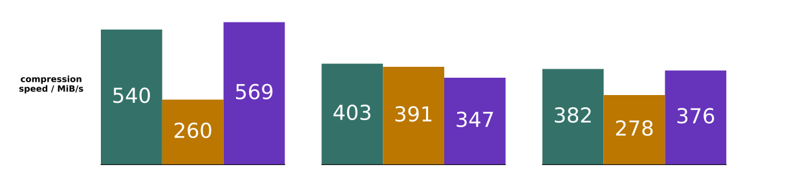
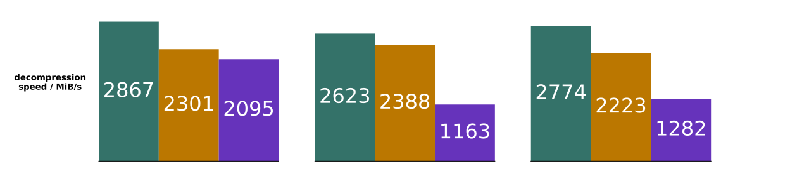

# Benchmarks

## Results

### Real World

Real world datasets are the best indicator of usefulness.
We have compared against 3 datasets, all of which are readily available and
accessible in download size:
* [Devin Smith's air quality data download](https://deephaven.io/wp-content/devinrsmith-air-quality.20220714.zstd.parquet) (15MB)
* [NYC taxi data (2023-04 high volume for hire)](https://www.nyc.gov/site/tlc/about/tlc-trip-record-data.page) (469MB)
* Reddit r/place 2022 data
  * [upstream Reddit post and original data](https://www.reddit.com/r/place/comments/txvk2d/rplace_datasets_april_fools_2022/)
  * [processed Parquet file download](https://pcodec-public.s3.amazonaws.com/reddit_2022_place_numerical.parquet) (1.3GB)

| dataset     | uncompressed size | numeric data types |
|-------------|-------------------|--------------------|
| air quality | 59.7MB            | i32, i64           |
| taxi        | 2.14GB            | f64, i32, i64      |
| r/place     | 4.19GB            | i32, i64           |

<div style="text-align:center">
  
  
  
</div>

These were again done on a single core of an M3 performance core.
Only numerical columns (the physical dtypes INT32, INT64, FLOAT, and DOUBLE)
were used.
For Blosc, the SHUFFLE filter and the Zstd default of Zstd level 3 was used.
For Parquet, the Parquet default of Zstd level 1 was used.

### Synthetic

Speeds are reported in count of numbers compressed or decompressed
per second with 2 significant figures.
Compression ratio is reported with 3 significant figures.

| dataset            | compression speed / (million/s) | decompression speed / (million/s) | compression ratio |
|--------------------|---------------------------------|-----------------------------------|-------------------|
| `f64_decimal`      | 36                              | 290                               | 4.67              |
| `f64_slow_cosine`  | 36                              | 290                               | 4.51              |
| `i64_lomax05_reg`  | 46                              | 590                               | 4.63              |
| `i64_sparse`       | 170                             | 690                               | 780               |
| `micros_millis`    | 35                              | 540                               | 2.14              |

`i64` and `f64` are each 8 bytes, so compression is around 300-500MB/s,
and decompression is around 2-5GB/s.

All figures reported here are calculated using a single thread on an Apple
M3 performance core, operating on in-memory data, using Rust 1.73.
Benchmarks were done by taking the median of 100 runs on a dataset of 1M
numbers with `compression_level` 8.

## Using the benchmarks

TL;DR (`cd`'d into the repo):
* `python bench/generate_randoms.py` (with numpy installed)
* `cargo run --release --bin bench`

The benchmarks support many things!
* different codecs
* all sorts of configurations on those codecs
* multiple datasets
  * synthetic, theoretically understood ones
  * arbitrary Parquet files
* measurement for compressed size, compression time, and decompression time

The script to generate the data uses python, so set up a python3
environment with `numpy` installed.
In that environment, run
`python bench/generate_randoms.py`.
This will populate some human-readable data in `bench/data/txt/` and
the exact same numerical data as bytes in `bench/data/binary/`.
For instance,
```
% head -5 bench/data/txt/f64_normal_at_0.txt
1.764052345967664
0.4001572083672233
0.9787379841057392
2.240893199201458
1.8675579901499675
```
shows floats sampled from a standard normal distribution.

Then to run Pco and decompression on each dataset, run
`cargo run --release --bin bench`.
This will show the compressed size and how long
it took to compress and decompress each dataset.
You can see the compressed files in
`bench/data/pco/`.

To run on a Parquet file instead of a synthetic benchmark, use
`-p /path/to/parquet`.
