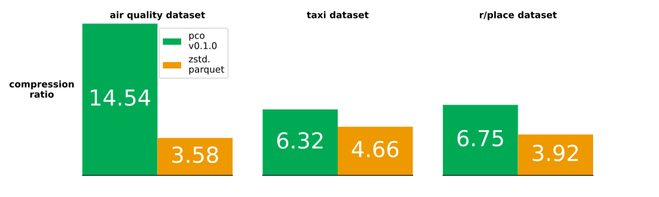
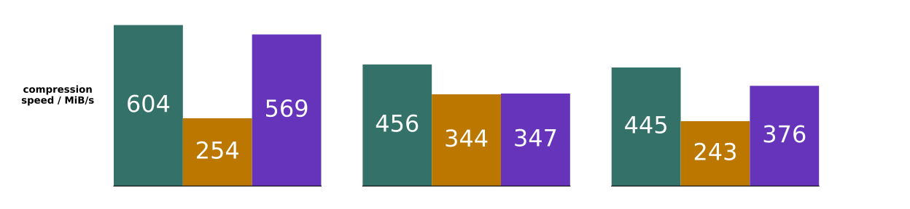
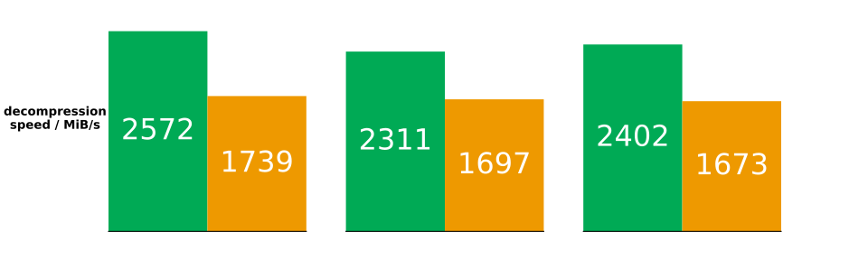

# Results

All speeds and compressed sizes reported below are available in
[the results CSV](./benchmark_results/mbp_m3_max_rust1_82.csv).
The CSV also includes some codecs not visualized here.

## Real World

Real world datasets are the best indicator of usefulness.
We have compared against 3 datasets, all of which are readily available and
accessible in download size:

* [Devin Smith's air quality data download](https://deephaven.io/wp-content/devinrsmith-air-quality.20220714.zstd.parquet)
  (15MB)
* [NYC taxi data (2023-04 high volume for hire)](https://www.nyc.gov/site/tlc/about/tlc-trip-record-data.page) (469MB)
* Reddit r/place 2022 data
  * [upstream Reddit post and original data](https://www.reddit.com/r/place/comments/txvk2d/rplace_datasets_april_fools_2022/)
  * [processed Parquet file download](https://pcodec-public.s3.amazonaws.com/reddit_2022_place_numerical.parquet)
    (1.3GB)

| dataset     | uncompressed size | numeric data types |
|-------------|-------------------|--------------------|
| air quality | 59.7MB            | i32, i64           |
| taxi        | 2.14GB            | f64, i32, i64      |
| r/place     | 4.19GB            | i32, i64           |

  
  
  

These were again done on a single core of an M3 performance core.
Only numerical columns were used.
For Blosc, the SHUFFLE filter and the Zstd default of Zstd level 3 was used.
For Parquet, the Parquet default of Zstd level 1 was used.

## Synthetic

You can also run a wide variety of synthetic benchmarks yourself using
[the cli](../pco_cli/README.md#bench).
