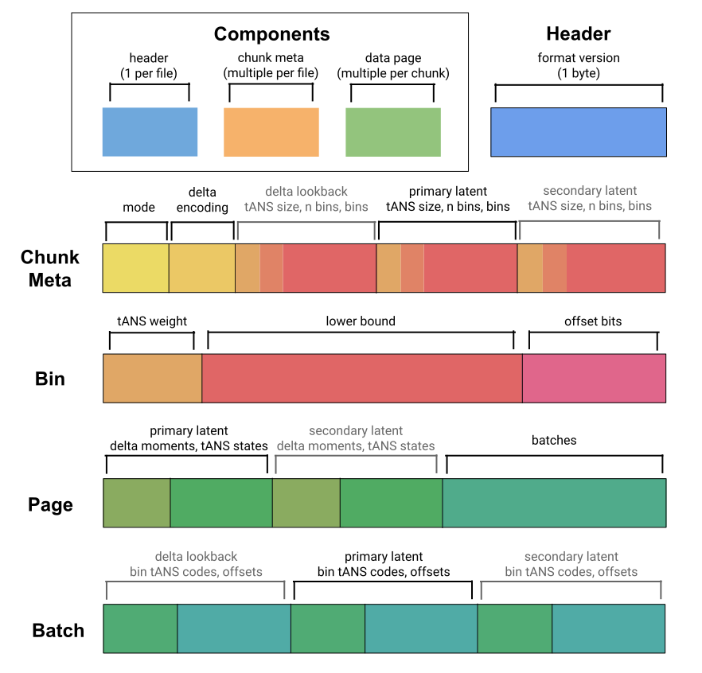
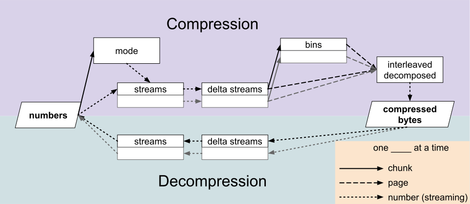

# Pco Format Spec

This document aims to describe the Pco format exactly.

All values encoded are unsigned integers.
All bit packing (and thus integer encoding) is done in a little-endian fashion.
Bit packing a component is completed by filling the rest of the byte with 0s.

Let `dtype_size` be the data type's number of bits.
A "raw" value for a number is a `dtype_size` value that maps to the number
via [its `from_unsigned` function](#numbers---latents).

## Wrapped Format Components



The wrapped format consists of 3 components: header, chunk metadata, and data
pages.
Wrapping formats may encode these components any place they wish.

Pco is designed to have one header per file, possibly multiple chunks per
header, and possibly multiple data pages per chunk.

### Header

The Pco format is versioned.
It is typically expected that changes are made in a backwards-compatible way,
so that decompressors can decompress any version of Pco up to their own
version.
This enables Pco to make small format changes in the future if necessary.
The header simply consists of

* [8 bits] the format version

So far, these format versions exist:

| format version | deviations from next version |
|----------------|------------------------------|
| 0              | int mult mode unsupported    |
| 1              | -                            |

### Chunk Metadata

It is expected that decompressors raise corruption errors if any part of
metadata is out of range.
For example, if the sum of bin weights does not equal the tANS size; or if a
bin's offset bits exceed the data type size.

Each chunk metadata consists of

* [4 bits] `mode`, using this table:

  | value | mode         | n latent variables | 2nd latent uses delta? |
  |-------|--------------|--------------------|------------------------|
  | 0     | classic      | 1                  |                        |
  | 1     | int mult     | 2                  | no                     |
  | 2     | float mult   | 2                  | no                     |
  | 3-15  | \<reserved\> |                    |                        |
* [0 or `dtype_size` bits] for int mult and float mult modes, a raw
  multiplier `mult` is encoded in the data type.
* [3 bits] the delta encoding order `delta_order`.
* per latent variable,
  * [4 bits] `ans_size_log`, the log2 of the size of its tANS table.
    This may not exceed 14.
  * [15 bits] the count of bins
  * per bin,
    * [`ans_size_log` bits] 1 less than `weight`, this bin's weight in the tANS table
    * [`dtype_size` bits] the lower bound of this bin's numerical range,
      encoded as a raw value.
    * [`log2(dtype_size) + 1` bits] the number of offset bits for this bin
      e.g. for a 64-bit data type, this will be 7 bits long.

Based on chunk metadata, 4-way interleaved tANS decoders should be initialized
using
[the simple `spread_state_tokens` algorithm from this repo](../pco/src/ans/spec.rs).

### Data Page

If there are `n` numbers in a data page, it will consist of `ceil(n / 256)`
batches. All but the final batch will contain 256 numbers, and the final
batch will contain the rest (<= 256 numbers).

Each data page consists of

* per latent variable,
  * if delta encoding is applicable, for `i in 0..delta_order`,
    * [`dtype_size` bits] the `i`th delta moment
  * for `i in 0..4`,
    * [`ans_size_log` bits] the `i`th interleaved tANS state index
* [0-7 bits] 0s until byte-aligned
* per batch of `k` numbers,
  * per latent variable,
    * for `i in 0..k`,
      * [tANS state `i % 4`'s bits] tANS encoded bin idx for the `i`th
        latent. Store the bin as `bin[i]`. Asymmetric Numeral System links:
        [original paper](https://arxiv.org/abs/0902.0271),
        [blog post explanation](https://graphallthethings.com/posts/streaming-ans-explained).
    * for `i in 0..k`,
      * [`bin[i].offset_bits` bits] offset for `i`th latent

## Standalone Format

The standalone format is a minimal implementation of the wrapped format.
It consists of

* [32 bits] magic header (ASCII for "pco!")
* [8 bits] standalone version
* [6 bits] 1 less than `n_hint_log2`
* [`n_hint_log2` bits] the total count of numbers in the file, if known;
  0 otherwise
* [0-7 bits] 0s until byte-aligned
* a wrapped header
* per chunk,
  * [8 bits] a byte for the data type. Up to 127 is reserved for built-in
    data types, and 128-255 are reserved for custom data types.
  * [24 bits] 1 less than `chunk_n`, the count of numbers in the chunk
  * a wrapped chunk metadata
  * a wrapped data page of `chunk_n` numbers
* [8 bits] a magic termination byte (0).

## Processing Formulas



### Numbers <-> Latents

Based on the mode, unsigneds are decomposed into latents.

| mode       | decoding formula                              |
|------------|-----------------------------------------------|
| classic    | `from_unsigned(latent0)`                      |
| int mult   | `from_unsigned(latent0 * mult + latent1)`     |
| float mult | `to_int_float(latent0) * mult + latent1 ULPs` |

Here ULP refers to [unit in the last place](https://en.wikipedia.org/wiki/Unit_in_the_last_place).

Each data type has an order-preserving bijection to an unsigned data type.
For instance, floats have their first bit toggled, and the rest of their bits
bits toggled if the float was originally negative:

```rust
fn from_unsigned(unsigned: u32) -> f32 {
  if unsigned & (1 << 31) > 0 {
    // positive float
    f32::from_bits(unsigned ^ (1 << 31))
  } else {
    // negative float
    f32::from_bits(!unsigned)
  }
}
```

Signed integers have an order-preserving wrapping addition and wrapping
conversion like so:

```rust
fn from_unsigned(unsigned: u32) -> i32 {
  i32::MIN.wrapping_add(unsigned as i32)
}
```

### Latents <-> Deltas

Latents are converted to deltas by taking consecutive differences
`delta_order` times, and decoded by taking a cumulative sum repeatedly.
Delta moments are emitted during encoding and consumed during decoding to
initialize the cumulative sum.

For instance, with 2nd order delta encoding, the delta moments `[1, 2]`
and the deltas `[0, 10, 0]` would decode to the latents `[1, 3, 5, 17, 29]`.

### Deltas <-> Bin Indices and Offsets

To dissect the deltas, we find the bin that contains each delta `x` and compute
its offset as `x - bin.lower`.
For instance, suppose we have these bins, where we have compute the upper bound
for convenience:

| bin idx | lower | offset bits | upper (inclusive) |
|---------|-------|-------------|-------------------|
| 0       | 7     | 2           | 10                |
| 1       | 10    | 3           | 17                |

Then 8 would be in bin 0 with offset 1, and 15 would be in bin 1 with offset 5.
10 could be encoded either as bin 0 with offset 3 or bin 1 with offset 0.
