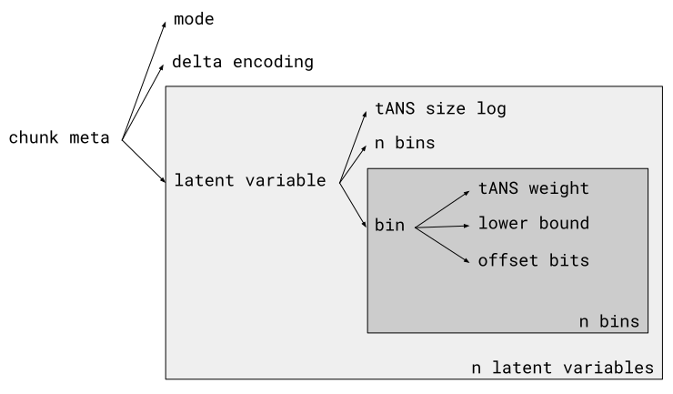
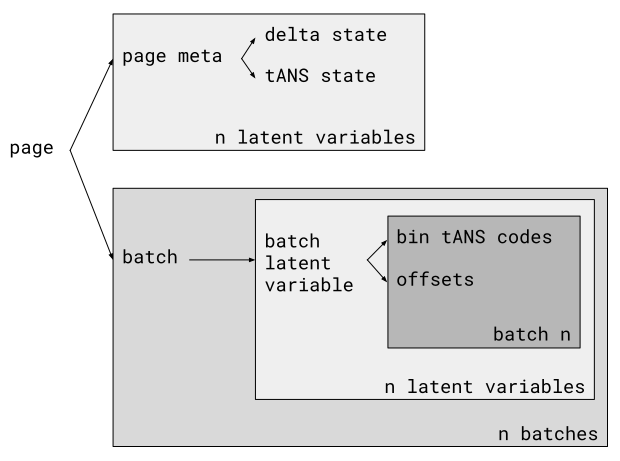

# Pco Format Spec

This document aims to describe the Pco format exactly.

All values encoded are unsigned integers.
All bit packing (and thus integer encoding) is done in a little-endian fashion.
Bit packing a component is completed by filling the rest of the byte with 0s.

Let `dtype_size` be the data type's number of bits.
A "raw" value for a number is a `dtype_size` value that maps to the number
via [its `from_unsigned` function](#Modes).

## Wrapped Format Components

The wrapped format consists of 3 components: header, chunk metadata, and data
pages.
Wrapping formats may encode these components any place they wish.
Pco is designed to have one header per file, possibly multiple chunks per
header, and possibly multiple pages per chunk.

[Plate notation](https://en.wikipedia.org/wiki/Plate_notation) for chunk
metadata component:



Plate notation for page component:



### Header

The Pco format is versioned.
It is typically expected that changes are made in a backwards-compatible way,
so that decompressors can decompress any version of Pco up to their own
version.
This enables Pco to make small format changes in the future if necessary.
The header simply consists of

* [8 bits] the format version

So far, these format versions exist:

| format version | first Rust version | deviations from next format version          |
|----------------|--------------------|----------------------------------------------|
| 0              | 0.0.0              | IntMult mode unsupported                     |
| 1              | 0.1.0              | FloatQuant mode and 16-bit types unsupported |
| 2              | 0.3.0              | delta variants and Lookback unsupported      |
| 3              | 0.4.0              | -                                            |

### Chunk Metadata

It is expected that decompressors raise corruption errors if any part of
metadata is out of range.
For example, if the sum of bin weights does not equal the tANS size; or if a
bin's offset bits exceed the data type size.

Each chunk meta consists of

* [4 bits] `mode`, using this table:

  | value | mode         | n latent variables | `extra_mode_bits` |
                                    |-------|--------------|--------------------|-------------------|
  | 0     | Classic      | 1                  | 0                 |
  | 1     | IntMult      | 2                  | `dtype_size`      |
  | 2     | FloatMult    | 2                  | `dtype_size`      |
  | 3     | FloatQuant   | 2                  | 8                 |
  | 4-15  | \<reserved\> |                    |                   |

* [`extra_mode_bits` bits] for certain modes, extra data is parsed. See the
  mode-specific formulas below for how this is used, e.g. as the `mult` or `k`
  values.
* [4 bits] `delta_encoding`, using this table:

  | value | delta encoding | n latent variables | `extra_delta_bits` |
  |-------|----------------|--------------------|--------------------|
  | 0     | None           | 0                  | 0                  |
  | 1     | Consecutive    | 0                  | 4                  |
  | 2     | Lookback       | 1                  | 10                 |
  | 3-15  | \<reserved\>   |                    |                    |

* [`extra_delta_bits` bits]
  * for `consecutive`, this is 3 bits for `order` from 1-7, and 1 bit for
    whether the mode's secondary latent is delta encoded.
    An order of 0 is considered a corruption.
    Let `state_n = order`.
  * for `lookback`, this is 5 bits for `window_n_log - 1`, 4 for
    `state_n_log`, and 1 for whether the mode's secondary latent is delta
    encoded.
    Let `state_n = 1 << state_n_log`.
* per latent variable (ordered by delta latent variables followed by mode
  latent variables),
  * [4 bits] `ans_size_log`, the log2 of the size of its tANS table.
    This may not exceed 14.
  * [15 bits] the count of bins
  * per bin,
    * [`ans_size_log` bits] 1 less than `weight`, this bin's weight in the tANS table
    * [`dtype_size` bits] the lower bound of this bin's numerical range,
      encoded as a raw value.
    * [`log2(dtype_size) + 1` bits] the number of offset bits for this bin
      e.g. for a 64-bit data type, this will be 7 bits long.

Based on chunk metadata, 4-way interleaved tANS decoders should be initialized
using
[the simple `spread_state_tokens` algorithm from this repo](../pco/src/ans/spec.rs).

### Page

If there are `n` numbers in a page, it will consist of `ceil(n / 256)`
batches. All but the final batch will contain 256 numbers, and the final
batch will contain the rest (<= 256 numbers).

Each page consists of

* per latent variable,
  * if delta encoding is applicable, for `i in 0..state_n`,
    * [`dtype_size` bits] the `i`th delta state
  * for `i in 0..4`,
    * [`ans_size_log` bits] the `i`th interleaved tANS state index
* [0-7 bits] 0s until byte-aligned
* per batch of `k` numbers,
  * per latent variable,
    * for `i in 0..k`,
      * [tANS state `i % 4`'s bits] tANS encoded bin idx for the `i`th
        latent. Store the bin as `bin[i]`. Asymmetric Numeral System links:
        [original paper](https://arxiv.org/abs/0902.0271),
        [blog post explanation](https://graphallthethings.com/posts/streaming-ans-explained).
    * for `i in 0..k`,
      * [`bin[i].offset_bits` bits] offset for `i`th latent

## Standalone Format

The standalone format is a minimal implementation of the wrapped format.
It consists of

* [32 bits] magic header (ASCII for "pco!")
* [8 bits] standalone version
* [6 bits] 1 less than `n_hint_log2`
* [`n_hint_log2` bits] the total count of numbers in the file, if known;
  0 otherwise
* [0-7 bits] 0s until byte-aligned
* a wrapped header
* per chunk,
  * [8 bits] a byte for the data type
  * [24 bits] 1 less than `chunk_n`, the count of numbers in the chunk
  * a wrapped chunk metadata
  * a wrapped page of `chunk_n` numbers
* [8 bits] a magic termination byte (0).

## Processing Formulas

In order of decompression steps in a batch:

### Bin Indices and Offsets -> Latents

To produce latents, we simply do `l[i] = bin[i].lower + offset[i]`.

### Delta Encodings

Depending on `delta_encoding`, the mode latents are further decoded.
Note that the delta latent variable, if it exists, is never delta encoded
itself.

#### None

No additional processing is applied.

##### Consecutive

Latents are decoded by taking a cumulative sum repeatedly.
The delta state is interpreted as delta moments, which are used to initialize
each cumulative sum, and get modified for the next batch.

For instance, with 2nd order delta encoding, the delta moments `[1, 2]`
and the deltas `[0, 10, 0]` would decode to the latents `[1, 3, 5, 17, 29]`.

#### Lookback

Letting `lookback` be the delta latent variable.
Mode latents are decoded via `l[i] += l[i - lookback[i]]`.

The decompressor should error if any lookback exceeds the window.

### Modes

Based on the mode, latents are joined into the finalized numbers.
Let `l0` and `l1` be the primary and secondary latents respectively.
Let `MID` be the middle value for the latent type (e.g. 2^31 for `u32`).

| mode       | decoding formula                                                       |
|------------|------------------------------------------------------------------------|
| Classic    | `from_latent_ordered(l0)`                                              |
| IntMult    | `from_latent_ordered(l0 * mult + l1)`                                  |
| FloatMult  | `int_float_from_latent(l0) * mult + (l1 + MID) ULPs`                   |
| FloatQuant | `from_latent_ordered((l0 << k) + (l0 << k >= MID ? l1 : 2^k - 1 - l1)` |

Here ULP refers to [unit in the last place](https://en.wikipedia.org/wiki/Unit_in_the_last_place).

Each data type has an order-preserving bijection to an unsigned data type.
For instance, floats have their first bit toggled, and the rest of their bits
toggled if the float was originally negative:

```rust
fn from_unsigned(unsigned: u32) -> f32 {
  if unsigned & (1 << 31) > 0 {
    // positive float
    f32::from_bits(unsigned ^ (1 << 31))
  } else {
    // negative float
    f32::from_bits(!unsigned)
  }
}
```

Signed integers have an order-preserving wrapping addition and wrapping
conversion like so:

```rust
fn from_unsigned(unsigned: u32) -> i32 {
  i32::MIN.wrapping_add(unsigned as i32)
}
```
